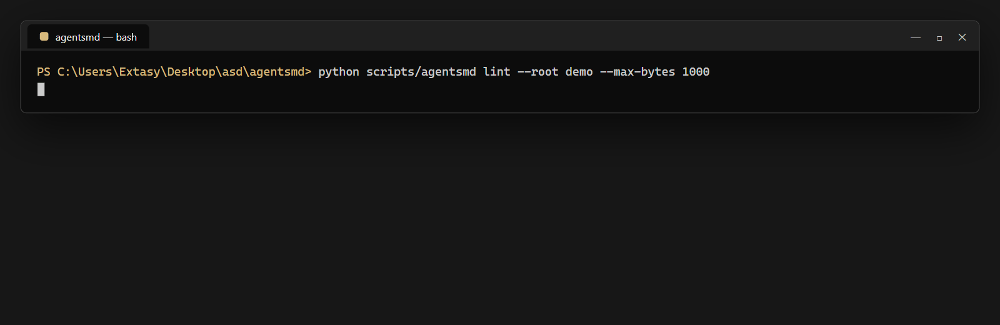
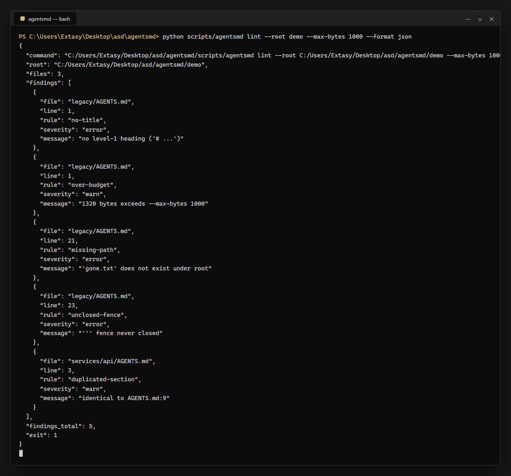

# agentsmd

**AGENTS.md files quietly rot. `agentsmd` compiles the hierarchy that actually applies to a path — and lints every file in it for reference rot, duplicated rules, broken fences, missing titles and context bloat.**

[](https://github.com/F0Rextasy/agentsmd/actions)
[](https://www.python.org/)
[](LICENSE)
[](https://skills.sh/b/F0Rextasy/agentsmd)
[](scripts/agentsmd)



caption: one scan over `demo/` — the clean root stays silent, the draft file trips four rules, the copied section trips the fifth.

## Why

`AGENTS.md` is becoming the shared instruction file coding agents read before they touch a repo. Hierarchies make it worse: every directory can define its own file, and nothing tells you that

- a child file **re-verbatim-copied** a parent section (pure context bloat),
- a backticked path in your rules points at a directory you deleted last month,
- a fence was never closed, so everything after it parses as code,
- the file is 40 KB of instructions the model will burn context on before writing a line,
- or that the file has **no title at all** and starts mid-thought.

`agentsmd` is two commands: `lint` finds those, `effective` shows you the compiled instruction set a path actually inherits (child wins, provenance per section).

## Quick start

```bash
python scripts/agentsmd lint --root .
python scripts/agentsmd effective src/api --root .
python scripts/agentsmd discover --root .
```

Or install it as an agent skill: `npx skills add F0Rextasy/agentsmd`

### Exit codes (CI-friendly)

| code | meaning |
|------|---------|
| 0 | clean — every file passed every rule |
| 1 | findings — at least one rule fired |
| 2 | usage error — bad flags, path outside `--root` |

## The rules

| rule | severity | catches |
|------|----------|---------|
| `no-title` | error | file without a level-1 `# heading` |
| `unclosed-fence` | error | a ``` fence that never closes (everything after it is mis-parsed) |
| `missing-path` | error | backticked repo path (`docs/`, `src/app.py`) that does not exist under `--root` |
| `over-budget` | warn | file larger than `--max-bytes` (default 24000 ≈ 6k tokens at 4 bytes/token) |
| `duplicated-section` | warn | child section byte-identical to the parent's section — restated rules, zero new information |

Spans with spaces (`git commit -m ...`), globs, URLs, flags and absolute paths are never treated as paths. Section parsing is fence-aware: a `## heading` inside a code block is not a heading.

## What a scan looks like

Real output of `python scripts/agentsmd lint --root demo --max-bytes 1000` (exit 1):

```text
legacy/AGENTS.md:1: no-title: no level-1 heading (`# ...`)
legacy/AGENTS.md:1: over-budget: 1320 bytes exceeds --max-bytes 1000
legacy/AGENTS.md:21: missing-path: `gone.txt` does not exist under root
legacy/AGENTS.md:23: unclosed-fence: ``` fence never closed
services/api/AGENTS.md:3: duplicated-section: identical to AGENTS.md:9
lint: 3 file(s), 5 finding(s)
```

The clean root file (`demo/AGENTS.md`) is silent — files with no findings are not printed.



`--format json` prints the same findings with `files`, `findings_total` and `exit` for machines.

## Compiling the effective chain

`python scripts/agentsmd effective examples/services/api --root examples`:

```text
<!-- compiled by agentsmd; sources: AGENTS.md > services/api/AGENTS.md -->

<!-- preamble from AGENTS.md -->
# Example monorepo

Agent instructions for the whole repository.

<!-- preamble from services/api/AGENTS.md -->
# API service

<!-- from services/api/AGENTS.md:3 -->
## Commands

Start the dev server with `npm run dev` in this directory.

<!-- from services/api/AGENTS.md:7 -->
## Conventions

Handlers validate input before touching the database.

<!-- from AGENTS.md:13 -->
## Review

Two approvals required for `src/` changes.
```

Child sections win, first-seen order is kept, and every section carries `<!-- from file:line -->` so you can audit where a rule came from. An intentional override is *not* a lint error — that is what `effective` is for.

## Evidence

`python bench/bench.py` — five failure classes plus a healthy tree, end-to-end CLI (interpreter start included), median of 3 runs, Windows, i5-9400F:

```text
fixture    expected            detected             signature median ms  verdict
--------------------------------------------------------------------------------
clean      ok                  -                    yes       59         ok
nopath     missing-path        missing-path         yes       56         ok
fence      unclosed-fence      unclosed-fence       yes       58         ok
notitle    no-title            no-title             yes       60         ok
dup        duplicated-section  duplicated-section   yes       59         ok
budget     over-budget         over-budget          yes       62         ok
bench: 6/6 fixtures correct
```

Machine-readable numbers: [`bench/results.json`](bench/results.json). Tests: `python -m unittest discover -s tests` → **8/8**, each asserting an observable contract (exit codes, finding rules, JSON schema, child-wins provenance).

## What it never does

- Never edits your files — report only, `effective` writes to stdout.
- Never touches the network, never executes anything from your tree.
- Never pretends token counts are exact — the budget is bytes ÷ 4 and says so.
- No dependencies beyond the Python standard library.

## One path, many gates — the family

| repo | what it gates |
|------|---------------|
| [mcpdiag](https://github.com/F0Rextasy/mcpdiag) | MCP server configs: real stdio handshake, which server is broken and why |
| [aitell](https://github.com/F0Rextasy/aitell) | deterministic AI-tell detection with a published confusion matrix |
| [cigate](https://github.com/F0Rextasy/cigate) | CI pipeline health gate |
| [route-drift](https://github.com/F0Rextasy/route-drift) | OpenAPI spec vs code routes drift gate |
| [compressproof](https://github.com/F0Rextasy/compressproof) | context-compression claims, measured |

## License

[MIT](LICENSE)
